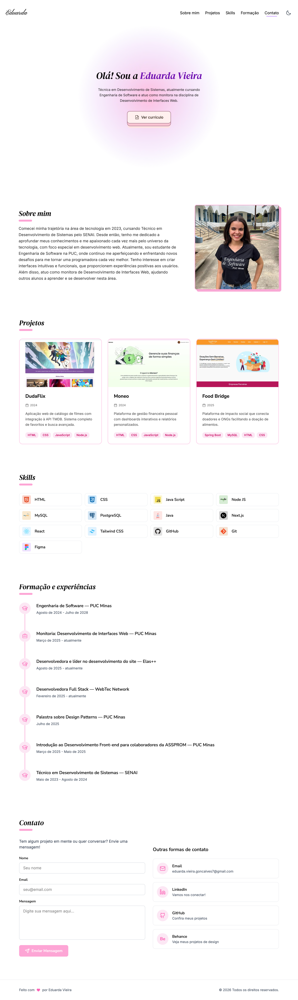

# Portfólio Eduarda Vieira

[🌐 Acesse meu portfólio online](https://portfolio-eduardavieira.vercel.app/)



Este é o repositório do meu portfólio pessoal, desenvolvido para apresentar meus projetos, habilidades e experiências de forma moderna e responsiva.

## Tecnologias Utilizadas

- [Next.js](https://nextjs.org/) — Framework React para produção
- [React](https://react.dev/)
- [TypeScript](https://www.typescriptlang.org/)
- [Tailwind CSS](https://tailwindcss.com/) — Estilização rápida e responsiva

## Estrutura do Projeto

```
components.json
eslint.config.mjs
next.config.ts
package.json
postcss.config.mjs
README.md
tsconfig.json
public/
	fullpage/
		FoodBridge/
		Moneo/
	icones/
	portfolio.png
src/
	app/
		globals.css
		layout.tsx
		page.tsx
		design-system/
			page.tsx
	components/
		CardProjeto.tsx
		Contato.tsx
		Footer.tsx
		Formacao.tsx
		MainPage.tsx
		ModalProjeto.tsx
		Navbar.tsx
		Projetos.tsx
		Skills.tsx
		Sobre.tsx
	data/
		projetos.ts
	lib/
		utils.ts
	types/
		projeto.ts
```

## Como rodar localmente

1. **Clone o repositório:**
	 ```bash
	 git clone https://github.com/eduardavieira-dev/Portfolio.git
	 cd Portfolio
	 ```
2. **Instale as dependências:**
	 ```bash
	 npm install
	 # ou
	 yarn install
	 ```
3. **Inicie o servidor de desenvolvimento:**
	 ```bash
	 npm run dev
	 # ou
	 yarn dev
	 ```
4. Acesse `http://localhost:3000` no navegador.

## Funcionalidades

- Página inicial com apresentação
- Seção de projetos com cards interativos
- Modal com detalhes dos projetos
- Seção de habilidades e formação
- Contato com links para redes sociais
- Layout responsivo e moderno

## Deploy

O deploy pode ser feito facilmente no [Vercel](https://vercel.com/) ou em qualquer serviço que suporte aplicações Next.js.

## Licença

Este projeto está sob a licença MIT.
